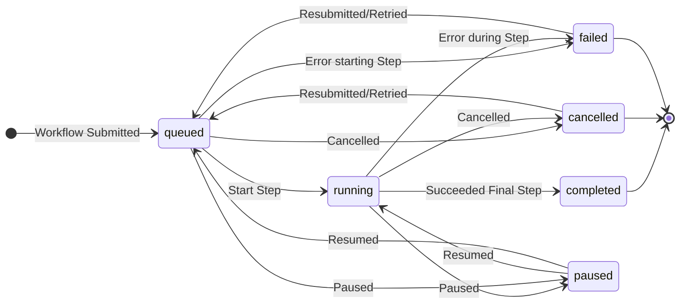

# MADSci Examples

```mermaid
stateDiagram
  direction LR
  [*] --> Queued:Workflow Submitted
  Queued --> Running:Start Step
  Queued --> Failed:Error starting Step
  Queued --> Cancelled:Cancelled
  Running --> Cancelled:Cancelled
  Running --> Completed:Succeeded Final Step
  Running --> Failed:Error during Step
  Paused --> Running:Resumed
  Running --> Paused:Paused
  Failed --> Queued:Resubmitted/Retried
  Cancelled --> Queued:Resubmitted/Retried
  Queued --> Paused:Paused
  Paused --> Queued:Resumed
  Completed --> [*]
  Cancelled --> [*]
  Failed --> [*]

  Queued:queued
  Running:running
  Failed:failed
  Cancelled:cancelled
  Completed:completed
  Paused:paused

```

## Generating Mermaid Diagrams

Use https://github.com/mermaid-js/mermaid-cli
